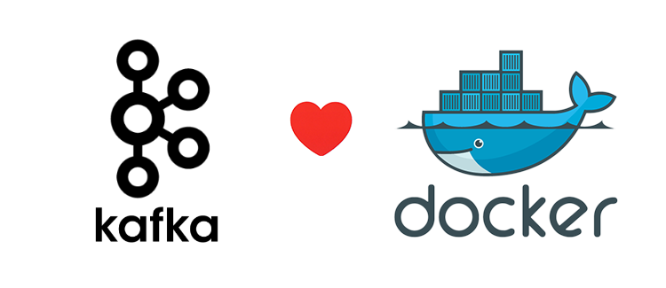

# Standalone Kafka

Inpsired by https://github.com/tobegit3hub/standalone-kafka

## Introduction

We run kafka(0.10.1.0) in container and make it super easy to develop, test and benchmark.

It's painless and everyone can setup kafka environment within seconds!



## Usage

```
docker run -d   --net=host -p 9092:9092  -p 2181:2181  -e HOSTNAME=localhost \
    procrastinatio/standalone-kafka-zookeeper 

```

It exposes 2181 for ZooKeeper and 9092 for Kafka. Just connect with them like local processes.

## Tutorial

You can run all the commands from [kafka documents](http://kafka.apache.org/documentation.html).

```
    cd kafka

    ./kafka/bin/kafka-topics.sh --create --zookeeper localhost:2181 \ 
             --replication-factor 1 --partitions 1 --topic test

    Created topic "test".

    ./kafka/bin/kafka-topics.sh --list --zookeeper localhost:2181
    test

    ./kafka/bin/kafka-console-producer.sh --broker-list localhost:9092 --topic test

    This is a message
    This is another message
    ^C

    ./kafka/bin/kafka-console-consumer.sh --bootstrap-server localhost:9092 --topic test \ 
        --from-beginning
    This is a message
    This is another message
```
